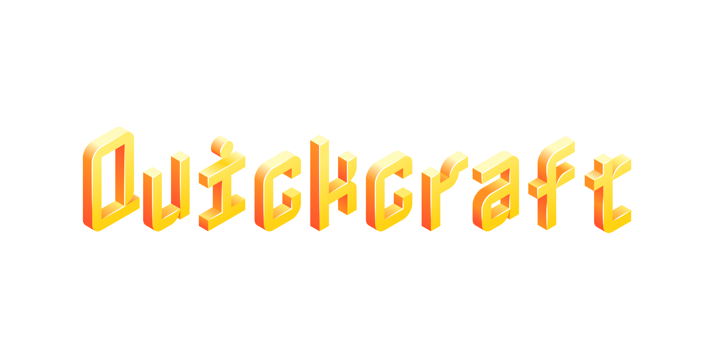

## TODOS:
- None

## Knows mistakes
- Skiped 2.1.0

## Docs

### How to use

[See the main page](.)

### Build dependencies
- jq

### Building

Clone this repo with

```sh
git clone https://github.com/Coolchickenguy/quickcraft.git && cd quickcraft
```

Build with
./buildfrom/release.sh <\version> <\rootUrl> <\name (of builder)> <\channel>
I.e.

```sh
./buildfrom/release.sh 2.0.0 https://yourwebsite.com/quickcraft yourwebsite release
```

As a more comprehensive example, here is the command that was used to build 2.4.1:

```sh
./buildfrom/release.sh 2.4.1 https://quickcraft.pages.dev\|https://coolchickenguy.github.io/quickcraft quickcraft_devs stable
```

Broken down, this is what the command did:
./buildfrom/release.sh: run the build script

2.4.1: that is the version.

https://quickcraft.pages.dev\|https://coolchickenguy.github.io/quickcraft: The \| is escaped |. This tells the updater that the servers to check for updates are https://quickcraft.pages.dev, and if that site is not reachable, check https://coolchickenguy.github.io/quickcraft. The first reachable site will be checked for any higher-numbered versions of the same channel (provided later), and ask the user if they want to install the version. If yes, install it.

quickcraft_devs: who made the release.

stable: the channel. See section above the quickcraft_devs section.
### Info

#### release_index.json format

```typescript
type format = {
  releases: {
    version: "major.minor.patch";
    win: "windows download url (zip)";
    linux: "linux download url (tar.gz)";
    macos: "macos download url (tar.gz)";
    channel: "dev" | "stable";
  }[];
};
```

#### Release format

##### All

Contains an assets directory with the icons/most source code.

###### Direct dependencies

- Python3 (auto installed localy on windows, installed via package manager on linux, required to be already installed on macOS)
- The following are auto-installed
- minecraft-launcher-lib ~= 7.1
- pyqt6 ~= 6.9.0 
- jpype1 ~= 1.5.2
- pip-tools ~= 7.4.1 
- PyQt6-WebEngine ~= 6.9.0
- pillow ~= 11.2.1
- PyOpenGL ~= 3.1.9
- numpy ~= 2.2.5

###### release_manifest.json format

In assets, there is release_manifest.json. This is usedto tell the code info about the build.

```typescript
type manifest = {
  vendor: {
    rootUrl: "(the root url of the website that hosts the build releases, ie https://coolchickenguy.github.io/quickcraft or multable, the first avalible one will be used, like https://quickcraft.pages.dev|https://coolchickenguy.github.io/quickcraft)";
    name: "(The name of the vendor)";
  };
  platform: "win" | "linux" | "macos";
  version: "(version of release, major.minor.patch)";
  channel: "dev" | "stable";
};
```

##### Windows

Release is a .zip file. The main directory, (not assets) has the public entry points installer.ps1 (for installing to the local dir) and start.ps1 (for starting). The assets directory has installer.ps1 and start.ps1 (what the main directory calls), get-pip.py for installing pip for the downloaded python version, and add_shortcut.py for adding the windows shortcut.

###### Extra dependencies for platform

- pywin32 (auto installed)

##### Linux

Release is a .tar.gz file. The main directory, (not assets) has the public entry points installer.sh (for installing to the local dir), and start.sh (for starting). The assets directory has installer.sh, start.sh (what the main directory call), and shortcut.desktop.from as a template for the shortcut.

###### Extra dependencies for platform

- None

##### macOS

Release is a .tar.gz file. The main directory, (not assets) has the public entry points installer.sh (for installing to the local dir), and start.sh (for starting). The assets directory has installer.sh and start.sh (what the main directory calls).

(macOS support is untested and minimal).

###### Extra dependencies for platform

- None
